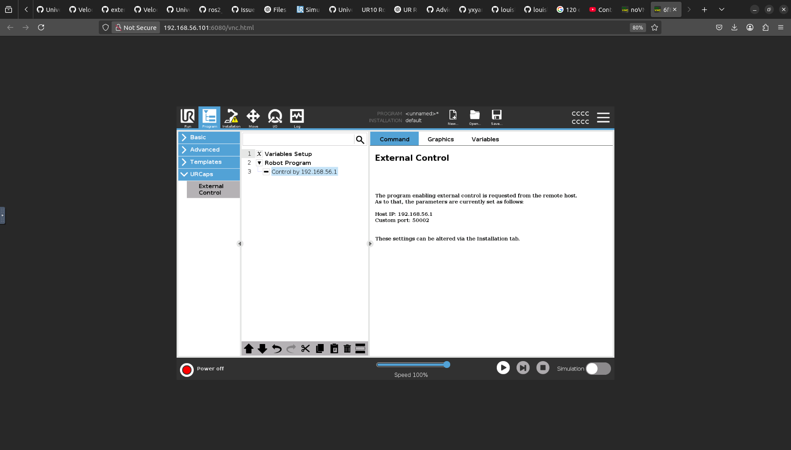
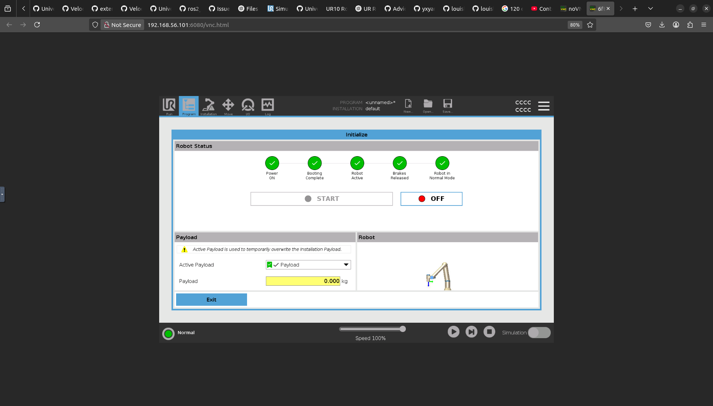
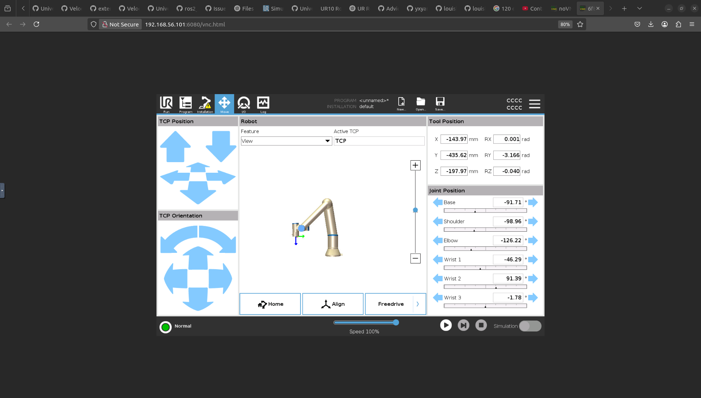

# UR10 Reach Task from Isaac Lab Sim2Real Transfer 

This repository uses a UR10 Reach task trained policy using Isaac Lab to do sim-to-real transfer. It has been tested with ROS2 Humble on Ubuntu 22.04.

## Table of Contents

- [Overview](#overview)
- [Prerequisites](#prerequisites)
- [Installation](#installation)
- [Usage](#usage)
  - [Sim2Sim Setup](#sim2sim-setup)
  - [Sim2Real Setup](#sim2real-setup)
- [Acknowledgments](#acknowledgments)
- [License](#license)

## Overview

This repository provides scripts to test a pretrained UR10 policy in simulation using URSim (sim2sim) and then transfer it to a real robot (sim2real). The simulation is based on the `ur_robot_driver` package. A pretrained policy is available in the `sample` directory. Note that you need to adjust the policy path in `ur.py`.

## Prerequisites

- **Operating System:** Ubuntu 22.04
- **ROS 2:** Humble Hawksbill  
  [Installation guide](https://docs.ros.org/en/humble/Installation/Ubuntu-Install-Debians.html)
- **UR Robot Driver:** [ur_robot_driver](https://github.com/UniversalRobots/Universal_Robots_ROS2_Driver)
- **Python:** Python 3

## Installation

1. **Install ROS 2 Humble:**  
   Follow the [ROS 2 installation guide](https://docs.ros.org/en/humble/Installation/Ubuntu-Install-Debians.html).

2. **Install the UR Robot Driver Package:**  
   ```bash
   sudo apt update
   sudo apt install ros-humble-ur-robot-driver
   ```

3. **Clone the Repository:**
   ```bash
   git clone https://github.com/louislelay/isaaclab_ur_reach_sim2real.git
   ```

## Usage

### Sim2Sim Setup

Follow these steps to run the simulation:

1. **Launch URSim:**

   Open a terminal and run:
   ```bash
   ros2 run ur_robot_driver start_ursim.sh -m ur10e
   ```
   This will launch URSim at http://192.168.56.101:6080/vnc.html. Click **Connect** and you should see an interface similar to:

   

2. **Activate External Control in URCaps:**

   In the **Programs** tab, below **URCaps**, click on **External Control**. Below **Robot Progam** you should see appear  : **Control by 192.168.56.1**

   

3. **Start the UR Robot**

   Click on the red button in the bottom left. Click on **On**, then **Start** until you obtain the following interface:
     
   

4. **Exit and Proceed:**

   - Press **Exit**.
   - Switch to the **Move** tab in the interface:
     
     

5. **Connect the interface to the computer:**

   - Press the play button in the bottom.
   - Select the **Control by 192.168...** option in the interface:
     
     

6. **Launch Robot Control:**

   In another terminal, run:
   ```bash
   ros2 launch ur_robot_driver ur_control.launch.py ur_type:=ur10e robot_ip:=192.168.56.101
   ```

7. **Run the Task Script:**

   Navigate to the Python directory within the repository:
   ```bash
   cd <path_to_repository>/isaaclab_ur_reach_sim2real/python
   ```
   **Note:** Ensure that the policy path in `ur.py` is updated to point to your pretrained policy (one is available in the `sample` directory if needed).

   Finally, run:
   ```bash
   python3 run_task.py
   ```
   The robot’s end effector should move to the target pose specified in the script.

8. **Demonstration Video:**

   Click on it to go to the youtube video and see the result.

   [](https://www.youtube.com/watch?v=B4jCdmKzhKA)

### Sim2Real Setup

This section is a work in progress (WIP).

## Acknowledgments

- **[Johnson Sun](https://github.com/j3soon)**: Many thanks for his valuable advice and time.
- **UR10Reacher Sim2Real for Isaac Gym:** [UR10Reacher repository](https://github.com/j3soon/OmniIsaacGymEnvs-UR10Reacher)
- **Isaac Lab:** [Isaac Lab repository](https://github.com/isaac-sim/IsaacLab)
- **UR Robot Driver:** [UR Robot Driver repository](https://github.com/UniversalRobots/Universal_Robots_ROS2_Driver)
- **ROS 2 Community:** [ROS 2 project](https://docs.ros.org/en/humble/index.html)

## License

This project is licensed under the [MIT License](LICENSE).
